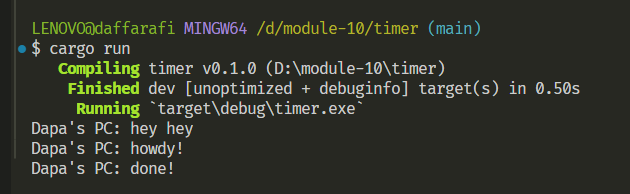
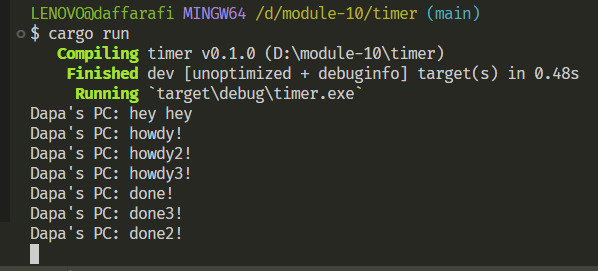

## Experiment 1.2: Understanding how it works.

Output yang dihasilkan diatas menunjukkan perilaku asynchronous. Instruksi spawner.spawn(...) memulai tugas asynchronous yang menunggu dua detik sebelum melanjutkan. Oleh karena itu, println("Dapa's PC: hey hey") akan dieksekusi lebih cepat dan muncul duluan dalam output, sebelum tugas asynchronous mencetak "howdy!" dan kemudian "done!" setelah dua detik. Hal ini terjadi karena asynchronous memungkinkan beberapa tugas berjalan secara paralel.

## Experiment 1.3: Multiple Spawn and removing drop

Output yang ditunjukan diatas menunjukkan urutan eksekusi tugas asynchronous. Saat spawner.spawn(...) digunakan untuk membuat tiga tugas yang mencetak pesan, menunggu dua detik, lalu mencetak pesan lain. Karena tugas ini berjalan secara paralel, mereka semua memulai hampir bersamaan.